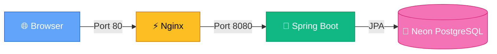
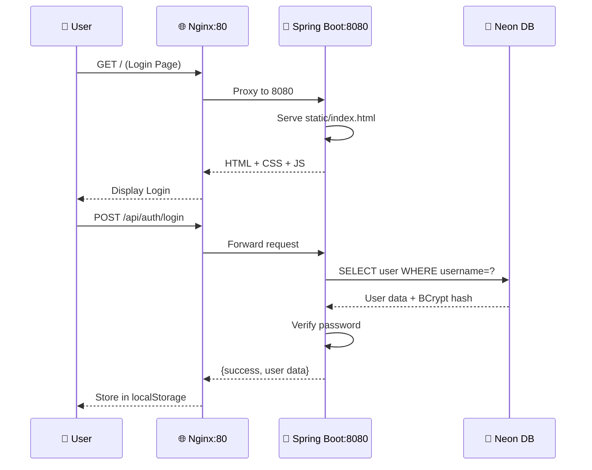
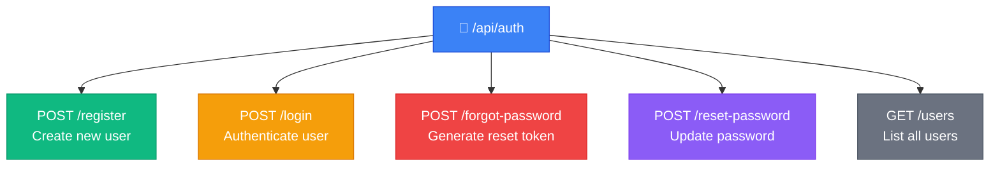
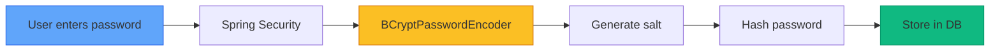
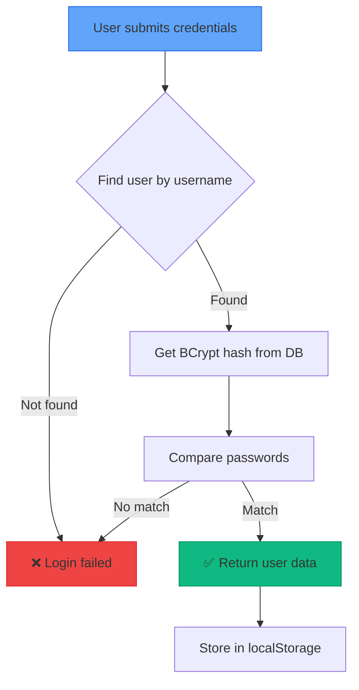
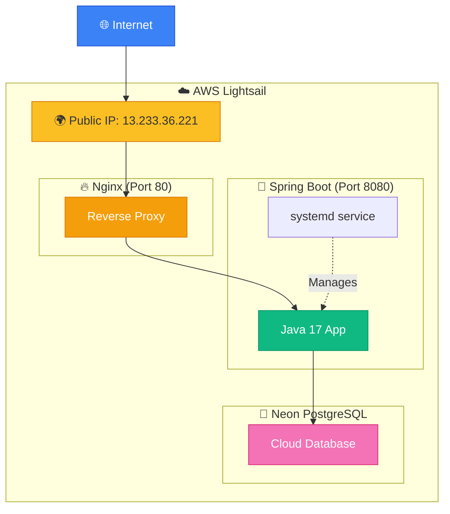
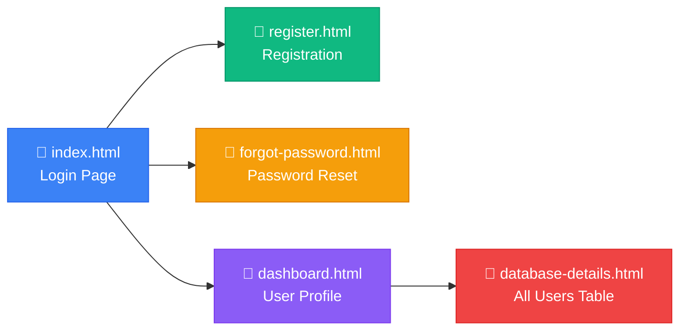
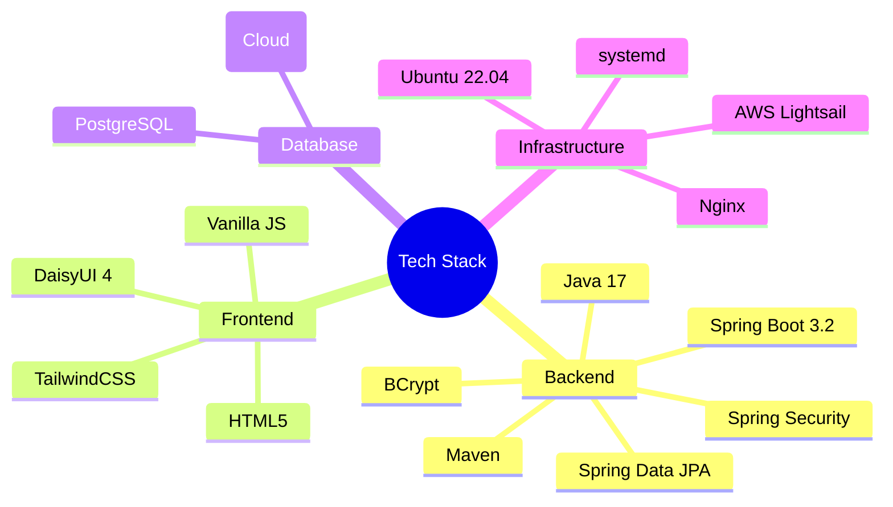

```markdown
# 🔐 Java Auth System - Complete Visual Guide

> [!INFO] Project Overview
> **Full-stack authentication system** with Spring Boot 3.2 + Neon PostgreSQL
> - **Frontend**: HTML5 + DaisyUI (served from Spring Boot)
> - **Backend**: Java 17 + Spring Security
> - **Database**: Cloud PostgreSQL (Neon)
> - **Deployment**: AWS Lightsail + Nginx

---

## 🏗️ System Architecture



### Request Flow



---

## 📁 Project Structure

```
Java-Auth-System/
├──  backend/
│   ├── pom.xml (Maven deps)
│   └── src/main/
│       ├── java/com/example/auth/
│       │   ├── AuthApplication.java 🚀
│       │   ├── config/
│       │   │   └── SecurityConfig.java 🔒
│       │   ├── controller/
│       │   │   └── AuthController.java 🎮
│       │   ├── service/
│       │   │   └── AuthService.java ⚙️
│       │   ├── entity/
│       │   │   └── User.java 📝
│       │   ├── repository/
│       │   │   └── UserRepository.java 💾
│       │   └── dto/ (Data Transfer Objects)
│       └── resources/
│           ├── application.properties ⚡
│           └── static/ (Frontend)
│               ├── index.html (Login)
│               ├── register.html
│               ├── forgot-password.html
│               ├── dashboard.html
│               ├── database-details.html
│               └── assets/app.js
└── 📁 frontend/ (Source copies)
```

---

## 🗺️ API Endpoints Map



### Endpoint Details

| Method | Endpoint | Purpose | Auth Required |
|--------|----------|---------|---------------|
| `POST` | `/register` | Create account | ❌ No |
| `POST` | `/login` | User login | ❌ No |
| `POST` | `/forgot-password` | Request reset token | ❌ No |
| `POST` | `/reset-password` | Reset with token | ❌ No |
| `GET` | `/users` | Get all users | ❌ No |

> [!WARNING] Security Note
> All endpoints are `permitAll()` - designed for learning/demo purposes

---

## 🗄️ Database Schema

```mermaid
erDiagram
    USERS {
        BIGINT id PK "Auto-generated"
        VARCHAR username "Unique, 50 chars"
        VARCHAR email "Unique, 100 chars"
        VARCHAR password "BCrypt hashed, 255 chars"
        VARCHAR reset_token "Password reset, 255 chars"
    }
    
    USERS -->|1:N| EVENTS : "generates"
    
    style USERS fill:#f472b6,stroke:#db2777,color:#fff
```

**Auto-created by Hibernate** (`ddl-auto=update`)

```sql
CREATE TABLE users (
    id BIGSERIAL PRIMARY KEY,
    username VARCHAR(50) NOT NULL UNIQUE,
    email VARCHAR(100) NOT NULL UNIQUE,
    password VARCHAR(255) NOT NULL,
    reset_token VARCHAR(255)
);
```

---

## 🔐 Security Flow

### Password Registration



### Login Authentication



---

## 🚀 Deployment Architecture



### Deployment Components

| Component | Purpose | Port |
|-----------|---------|------|
| **Nginx** | Reverse proxy, SSL termination | 80 |
| **Spring Boot** | Application server | 8080 |
| **systemd** | Process management | - |
| **Swap** | Prevent OOM during build | 2GB |

---

## 🔄 Deployment Workflow


### Update Process

```bash
# 1. Pull latest code
cd ~/Java-Auth-System && git pull

# 2. Rebuild application
cd backend && mvn clean package -DskipTests

# 3. Restart service
sudo systemctl restart auth-app

# 4. Monitor logs
journalctl -u auth-app.service -f -n 50
```

---

## 🔧 Systemd Service Configuration

```
[Unit]
Description=Spring Boot Auth System
After=network.target

[Service]
User=ubuntu
WorkingDirectory=/home/ubuntu/Java-Auth-System/backend
ExecStart=/usr/bin/java -jar target/auth-system-1.0.0.jar
Restart=always
RestartSec=10
Environment=DB_URL=jdbc:postgresql://...
Environment=DB_USER=neondb_owner
Environment=DB_PASSWORD=***

[Install]
WantedBy=multi-user.target
```

> [!TIP] Environment Variables
> Database credentials injected via systemd, NOT in application.properties

---

## 🎨 Frontend Pages



### UI Features
-  **DaisyUI Dark Theme** (`data-theme="dark"`)
- 📱 **Responsive Design** (TailwindCSS)
- 💾 **localStorage** for session management
- 🔑 **Relative API paths** (no CORS issues)

---

## 📊 User Management Flow

```mermaid
stateDiagram-v2
    [*] --> Anonymous
    Anonymous --> Registering: Click "Register"
    Registering --> Registered: Submit form
    Registered --> Logging: Enter credentials
    Logging --> Authenticated: Valid credentials
    Logging --> Anonymous: Invalid credentials
    Authenticated --> ViewingDashboard: Access dashboard
    ViewingDashboard --> ViewingUsers: View all users
    ViewingUsers --> Authenticated: Navigate
    Authenticated --> [*]: Logout (clear localStorage)
    
    style Anonymous fill:#6b7280,stroke:#4b5563
    style Authenticated fill:#10b981,stroke:#059669
    style [*] fill:#3b82f6,stroke:#2563eb
```

---

## 🔍 Debugging & Monitoring

### Essential Commands

```bash
# 📋 View live logs
sudo journalctl -u auth-app.service -f

# 🔍 Check if Java process running
ps aux | grep java

# 🔄 Restart application
sudo systemctl restart auth-app

# 📊 Check service status
sudo systemctl status auth-app

# 🌐 Check Nginx status
sudo systemctl status nginx

# 📄 View app logs
tail -f ~/Java-Auth-System/backend/app.log
```

---

## 🧪 Test Users

| Username | Email | Password |
|----------|-------|----------|
| `john_doe` | john@example.com | `password123` |
| `jane_smith` | jane@example.com | `password123` |

> [!NOTE] Create More Users
> - Via UI: Register page
> - Via API: `POST /api/auth/register`

---

## 🔗 Key Technologies



---

## ⚡ Quick Reference

### Ports & URLs
- **Public Access**: `http://13.233.36.221` (Port 80)
- **Direct App**: `http://13.233.36.221:8080` (Port 8080)
- **Database**: Neon Cloud (SSL required)

### File Locations
- **App JAR**: `/home/ubuntu/Java-Auth-System/backend/target/`
- **Service File**: `/etc/systemd/system/auth-app.service`
- **Nginx Config**: `/etc/nginx/sites-available/auth-app`
- **Logs**: `journalctl -u auth-app.service`

### Firewall Rules
- ✅ Port 22 (SSH)
- ✅ Port 80 (HTTP)
- ✅ Port 8080 (Custom TCP)

---

> [!SUCCESS] System Status
> **All components operational**
> - Frontend served via Nginx ✅
> - Backend running on port 8080 ✅
> - Database connected (Neon) ✅
> - Authentication working ✅
> - Password reset functional ✅

---

**Last Updated**: {{date}}
**Status**: 🟢 Production Ready
```

